# PackagePro — Dynamic Tour Packages

[](https://github.com/siddhartha0132/packagepro-best/actions/workflows/verify.yml)

Start from a curated package, reshape it piece by piece, and watch it reprice live. Add a local guide by language and specialisation; every guide is checked day by day against real availability, and a clash is refused with the date named, a compliant substitute and the new total. On the web and in Telegram, in four languages.

**Live app:** **[https://packagepro-best-production.up.railway.app/](https://packagepro-best-production.up.railway.app/)** · guided tour for judges: **[/how-it-works](https://packagepro-best-production.up.railway.app/how-it-works)** · one-tap demo: **[/?demo=1](https://packagepro-best-production.up.railway.app/?demo=1)** · Telegram: **[@wayypoint_Bot](https://t.me/wayypoint_Bot)**

**At a glance**

| | |
|---|---|
| Mandatory guide availability check | Enforced in the backend, proven by [`tests/hardProof.guideAvailability.test.ts`](tests/hardProof.guideAvailability.test.ts) |
| Shared data model | Canonical tables read and written; organisers' validator **PASS** (`pnpm conformance`) |
| Tests | 85 offline tests (`pnpm verify`, run by GitHub Actions on every push) + 4 live-key checks — `npx vitest run` → 89 passed · voice: 20/20 (`pnpm voice:eval`) |
| Guided tour for judges | `/how-it-works`: every PS-04 requirement, where it is in the code, and a live demo |
| Brief | [HACKATHON.md](HACKATHON.md) · [Architecture](docs/ARCHITECTURE.md) · [Data model](data-model/DATA_MODEL.md) · [AI](ai/README.md) · [API](docs/API.md) · [Demo script](docs/DEMO_SCRIPT.md) |

## Team & Problem Statement

- **Team:** RNG Gods · BMS College of Engineering
- **Event:** KogniVera Hackathon 2026
- **Problem statement:** **PS-04 — PackagePro: Dynamic Tour Packages**

## What we built

- **Curated package listing and detail pages.** 45 PS-04 packages, browsed by theme. Each detail page shows the itinerary, inclusions/exclusions and transparent pricing: the base price plus every component, and the lines add up to the total.
- **One fully customisable package, repriced live.** Swap the hotel tier, an activity or the transfer (the new choice keeps the same day and slot), remove any line except the stay and add it back, toggle recommended add-ons, change the duration, and add or remove guides. The itinerary and total recompute on every change. Over budget, the engine offers priced fixes (cheaper flight / stay / activity, fewer days) and a one-tap "fit my budget"; recommendations, undo and discard keep it easy. The flight, stay and extras can already be picked on the live estimate.
- **Guide as a component, with the mandatory availability check.** Guides are picked by language, specialisation and price. Each is checked against `guide_availability` and the remaining slots on every trip date. An unavailable guide is **refused with the clashing date named**, the nearest **same-language, same-specialisation substitute** is offered, and the total is **repriced**. Confirmed bookings consume slots, so a guide can't be double-booked. Guides can also be **planned day by day** in a live availability grid: book a guide on just the days they're free, and cover the other days with another guide.
- **Language preferences.** There are 4 app languages (English, हिन्दी, தமிழ், తెలుగు) and 12 guide languages (BCP-47). A traveller profile read from `users` + `user_preferences` sets both. Packages offered in the guide language rank first, and guides are filtered by it. Dataset content, AI replies and the PDF quotation follow the chosen language.
- **AI package builder.** It works from free-text interests, budget and **booking history** (the traveller's past trips), picks only real catalogue packages, keeps to the stated budget, and builds the chosen trip in one tap. A grounded agent explains every decision.
- **Save, share and book.** Drafts auto-save, and a share link reopens the exact trip. Booking writes the canonical `trips` / `itineraries` / `itinerary_items` / `bookings` rows with an idempotency key and returns a PNR. There's a downloadable PDF quotation, and a **Telegram bot** runs on the same engine.
- **Telegram: step by step, with a travel agent's approval.** The bot walks the traveller through flight → stay → extras → guide → review and sends the quotation as a real PDF in their language. "Request booking" writes a `pending` booking (guide dates held) and sends it to a travel agent's Telegram chat with Approve / Reject. On approval the traveller gets the PNR, the **bill as a PDF** and a signed link; on rejection, the reason and "Request again".
- **Travel desk with counter-offers (`/agent`).** Requests from the website and Telegram in one list, each with the full day-by-day plan. The agent approves, rejects with a reason, or sends a counter-offer (swap the stay or an activity, add/remove an add-on, a discount or surcharge, a note) priced live on the whole trip. The traveller accepts in one tap on the web page or in Telegram and is booked at once, or keeps the original request. Website travellers give a mobile number or email when they send the request; each answer from the agent reaches them by SMS / email (Twilio / Resend) with a private link back to the trip, and **My bookings** finds a trip again by reference + mobile/email — no passwords.
- **An itinerary that reads in order.** Day 1 starts when the flight lands (nothing is scheduled before it), the transfer comes right after, empty days say "Free time to explore", and a last day shows check-out on the return date — the same on the web, in Telegram and in the PDF.

| PS-04 "What you need to build" | Where it is |
|---|---|
| Browse curated packages by theme, detail pages (itinerary, inclusions, transparent pricing) | Home listing + detail dialog (`frontend/src/pages/Home.tsx`), `packagepro.list/detail` |
| Customise hotel tier, activities, transfers, duration with live repricing | `frontend/src/components/PackageCustomiser.tsx`, `trip.swap/toggleAddOn/setDuration`, `backend/src/trips.ts → priceBreakdown()` |
| AI package-builder from interests, budget and booking history | `ai/pipeline.ts → matchPackagesFromInterests()` + `backend/src/travellers.ts` |
| Add-on recommendations for the chosen package | `package_components.is_optional` rows → "Recommended add-ons" |
| Tour-guide selection by language, specialisation, availability and price | `trip.guides/selectGuide`, `backend/src/packagepro.ts → guideCheck()/isGuideFree()` |
| Language preferences for app and guide/tour delivery | "Travelling as" profile (`user_preferences`), app-language and guide-language pickers |
| Save, share and book | Draft + `#trip=` share links, `trip.confirm` (idempotent), PDF quotation |
| **Mandatory: Guide Availability Check** | `trip.selectGuide` refusal → named dates, substitutes, repriced totals · hard-proof test below |

## Architecture

**Web app** (React 19, Vite, Tailwind, `frontend/`) and **Telegram bot** (`backend/src/telegramBot.ts`) → **tRPC API** (`backend/src/routers.ts`) → **trip engine** (`backend/src/trips.ts`: pricing, swaps, negotiation, booking) → **catalogue and guide rules** (`backend/src/packagepro.ts`) over the read-only **PS-04 dataset** (`data-model/seed/PS-04.db`), plus a read-write **app database** (canonical tables + additions). **AI** (`ai/pipeline.ts`, Sarvam) and **integrations** (`backend/src/integrations.ts`: SerpAPI Google Flights, Sarvam translation, Wikipedia photos) sit beside the engine. 



[docs/ARCHITECTURE.md](docs/ARCHITECTURE.md) has 9 diagrams: system overview, repository map, the guide availability check (sequence), the booking transaction, the pricing model, the AI pipeline, the data model (ER), deployment, and a frontend ↔ backend module map. API: [docs/API.md](docs/API.md).

## Data model

- **Canonical tables read:**
  - `tour_packages`, `package_components` (swaps; price = base + kept `price_delta`s), `tour_guides`, `guide_availability` (dates, slots, price multipliers)
  - `hotels` + `hotel_room_types`, `transfers`, `cities`, `languages` (BCP-47 validation)
  - `users` + `user_preferences` (language preference and interests), `bookings` → `trips` (booking history)
- **Canonical tables written:** `trips`, `itineraries`, `itinerary_items`, `bookings`, created verbatim from the dataset DDL, with an idempotency key on `bookings`.
- **Additions** (rule R1, additive only):
  - `app_guide_bookings` — confirmed guide slots per date
  - `app_trips` — working state of a trip being customised
  - `app_bot_sessions` — Telegram conversation state
  - `bookings.contact_email`, `bookings.contact_phone`, `bookings.guide_id`
- **Enforced in the backend, with tests:** party size within `min_group_size…max_group_size`, BCP-47 languages, INR only, money in integer paise (never a float), guide capacity, idempotent booking.
- **Organisers' validator:** `tools/validate_conformance.py` **passes** on the dataset merged with our rows (`pnpm conformance`).

Full mapping, rules R1–R8 and where each is enforced: [data-model/DATA_MODEL.md](data-model/DATA_MODEL.md) · schema: [data-model/schema.sql](data-model/schema.sql).

## AI features

| Capability | Mechanism | Grounding |
|---|---|---|
| Package builder (interests, budget, booking history) | Sarvam `sarvam-105b-conversations`, JSON prompt; OpenRouter fallback | Chooses only from the 45 catalogue packages; the budget is enforced before and after the model; the traveller's `user_preferences` and past trips are attached server-side; fallback: interest scoring (mood → dataset theme + places known for it, in 4 languages) |
| Trip-request parser ("Mumbai to Goa for 3 days") | Rules with city aliases, then the model | Catalogue cities only |
| Transparent agent ("why was Meera refused?") | Sarvam chat | Live trip context: the refusal dates, substitutes and new totals; "never invent inventory or prices" |
| Estimate insight | Grounded 3-bullet completion | Only the live facts: fares, package, guides, past-traveller popularity |
| Multilingual content | Sarvam `mayura:v1` translation (cached) + native-language replies | Dataset strings; names never translated; contractual text hand-written |
| **Voice planning** (Telegram voice notes + web mic) | Sarvam `saarika:v2.5` (words as spoken) + `saaras:v2.5` (English meaning + language) in; `bulbul:v3` MP3 voice reply out (`backend/src/voice.ts`) | The English meaning goes through the same trip planner (catalogue cities only), the reply is in the detected language; **20/20 in English, Hindi, Tamil, Telugu, 0 invented destinations, median 1.7 s** ([docs/VOICE_EVAL.md](docs/VOICE_EVAL.md)) |

Details, prompts and how we know each works: [ai/README.md](ai/README.md).

## Run it locally

Needs **Node 22.13+** (built-in `node:sqlite`) and **pnpm**.

```bash
pnpm install
cp .env.example .env          # optional keys: SARVAM_API_KEY (AI + translation), SERP_API_KEY (live fares)
pnpm db:reset                 # optional: start from a clean app database
pnpm dev                      # web + API (+ Telegram bot if TELEGRAM_BOT_TOKEN is set)
```

Open **http://localhost:3000**. The same build runs live at **https://packagepro-best-production.up.railway.app/**.
- **Data:** the PS-04 dataset ships in `data-model/seed/PS-04.db`. No migration step: the app database and its canonical tables are created on first start.
- **Without API keys** the app runs on catalogue fares and rule-based text.
- **Production:** `pnpm build && pnpm start`.

## Demo path

**Live:** **https://packagepro-best-production.up.railway.app/** (or http://localhost:3000). **Guided tour:** **[/how-it-works](https://packagepro-best-production.up.railway.app/how-it-works)** — every PS-04 requirement with how we solve it, where it is in the code, and a live 3D demo.

The terminal outcome: **a customised package, booked, with the guide rule shown**. Locally, stop the server and run `pnpm db:reset` first so the demo guide's slots are free (confirming a booking with Arjun uses his only slots on 29–30 Sept).

1. Click **▶ Try the live demo**. This fills in New Delhi → Thanjavur, 28 Sept → 1 Oct, **4 travellers** (the package takes 4–8), a Tamil guide and ₹1,50,000. The live estimate shows Low / Typical / High against the budget.
2. **Continue to flights** and pick a live Google Flights fare.
3. **Customise:** swap the hotel, add an add-on, change the duration. Watch the itinerary and total reprice.
4. **Guides → Meera Novak.** She is **refused: unavailable on 2026-09-28** (red on her calendar). **Arjun Nair** is offered with the same language (ta) and specialisation (heritage), all green, with *−₹11,160 vs Meera* and the total repriced. Click **Use Arjun Nair**.
5. **Continue to review → Confirm.** You get a booking reference (PNR). Try **Download quotation PDF**.
6. **Language:** pick **Travelling as → Anita Bhat**. The app switches to Tamil, the guide language to `ta`, and her interests and past trips drive "Picked for you".
7. **AI:** in *Plan it with AI*, type "beach honeymoon under 40k" (or in Hindi or Tamil), then tap **Build this package**.
8. **Telegram:** send `/demo` to **@wayypoint_Bot** → Build my trip → pick a flight, then follow the steps (stay → extras → guide → review). At the guide step pick Meera Novak: you get the same refusal, date strips and substitute. At review you get the quotation PDF; **Request booking** goes to the travel agent's chat, and **Approve** sends you the bill PDF.
9. **Travel desk:** with `AGENT_DASHBOARD_KEY` set, review a trip → **Send to travel agent**. Open `/agent` in another tab (enter the key), pick the request, swap the stay and take ₹2,000 off → **Send counter-offer**. Back on the trip page, **Accept and book** → PNR, the discount on its own line, and **Download bill (PDF)**.
10. **Voice:** send @wayypoint_Bot a voice note in Tamil, Hindi, Telugu or English ("Plan a three-day trip to Thanjavur"). It shows what it heard, answers in that language and replies with a voice note. On the web, tap 🎙 in *Ask why PackagePro chose this* and speak.

## Tests / proof

```bash
pnpm verify                                                   # type check + lint + 85 offline tests + production build (also runs before every push)
npx vitest run                                                # everything: 85 offline + 4 live-key checks (reads .env) → 89 passed
npx vitest run tests/hardProof.guideAvailability.test.ts     # the PS-04 hard proof
pnpm voice:eval                                               # 20 spoken requests in 4 languages through the real voice pipeline → docs/VOICE_EVAL.md (needs SARVAM_API_KEY)
pnpm conformance                                              # organisers' validator on dataset + our rows → PASS
```

- **Hard proof** (`tests/hardProof.guideAvailability.test.ts`): a guide is added on clashing dates → refused → the refusal names 2026-09-28 → the substitute has the same language and specialisation → the offered total equals the booked total.
- **Data model** (`tests/conformance.test.ts`): canonical rows for a confirmed trip; idempotent re-confirm; `validate_conformance.py` **PASS**.
- **Engine** (`tests/packagepro.test.ts`):
  - pricing identity (base + itinerary lines = total), swaps and add-ons per person / room / vehicle
  - duration changes, negotiation, group-size and BCP-47 rules
  - guide slots (a second traveller is refused; a late confirm is refused, not double-booked), traveller profiles
- **AI** (`tests/aiChat.test.ts`) and **Telegram** (`tests/telegramBot.test.ts`): every flow with a fake Telegram API, messages within Telegram limits, all 4 languages.

The tests run offline: the LLM and live fares are off under test, so every fallback path is covered.

---

### Deploy (Railway)

`railway.json` builds with `pnpm build` and starts with `pnpm start`.
1. **Variables:** set those from `.env.example`, plus `PACKAGEPRO_APP_DB=/data/packagepro-app.db`.
2. **Volume:** add one at `/data`. The dataset ships in the repo under `data-model/seed/`.
3. **Domain:** generate one.
4. **Travel agent (optional):** set `AGENT_DASHBOARD_KEY` for the web travel desk at `/agent`, and/or have the agent send `/chatid` to the bot and put that number in `AGENT_TELEGRAM_CHAT_ID`. `railpack.json` installs Chromium + Noto fonts so the server can make PDF files.

Only one running instance may poll a Telegram token, so by default only the deployed server (`NODE_ENV=production`) runs the bot; set `TELEGRAM_BOT_DISABLED=false` to run it from a local `pnpm dev` instead. Keep a single instance, because active trips are cached in memory in front of SQLite.

### Useful commands

`pnpm lint` runs ESLint (errors fail `pnpm verify`). `pnpm db:show` shows bookings, guide dates and slot usage. `pnpm db:reset` clears the app database. `pnpm db:schema` regenerates `data-model/schema.sql`. `pnpm conformance` runs the organisers' validator.

### Repository layout

A pnpm workspace (`pnpm-workspace.yaml`). `frontend/` and `backend/` are workspace packages with their own `package.json` and scripts, for example `pnpm --filter @packagepro/backend dev`. Shared dependencies are hoisted in the root `package.json`, whose scripts (`pnpm dev`, `pnpm build`, `pnpm verify`) run the whole app.

| Path | What |
|---|---|
| `frontend/` | UI app (React 19 + Vite + Tailwind): `package.json`, `src/pages`, `src/components`, `src/i18n.ts`, `src/lib`, `index.html` |
| `backend/` | `package.json` + `src/`: API and services (Node + Express + tRPC): trip engine `trips.ts`, catalogue and guide rules `packagepro.ts`, `travellers.ts`, `estimate.ts`, `integrations.ts`, `appStore.ts`, Telegram bot, `routers.ts`, `_core/` server bootstrap |
| `backend/shared/`, `backend/drizzle/`, `backend/src/_core/` (oauth, sdk, context) | Server bootstrap and the starter template's optional login; PackagePro's flows use dataset traveller profiles and don't require it |
| `data-model/` | `DATA_MODEL.md` (tables used, additions, rules), generated `schema.sql`, `seed/` (PS-04 dataset + DDL + enums + starter queries + demo caches) |
| `ai/` | AI pipeline (`pipeline.ts`: model calls, trip parser, package builder, agent) and `prompts/` (every system prompt) |
| `docs/` | `ARCHITECTURE.md` (9 diagrams), `diagrams/*.svg`, `API.md`, `DEMO_SCRIPT.md`, `pitch/PackagePro-PS04.pptx` (11-slide pitch deck with real app screenshots in `pitch/assets/`; rebuilt by `pitch/build_deck.py`) |
| `tests/` | Automated tests, including the hard-proof `hardProof.guideAvailability.test.ts` and `conformance.test.ts` |
| `tools/` | Organisers' `validate_conformance.py` |
| `scripts/` | `conformance.mjs`, `show-bookings.mjs`, `dump-schema.mjs`, `reset-db.mjs` (refuses while the server holds the database) |
| `data/` | Runtime only: the local app database (git-ignored) |

### Security

Secrets live only in `.env` (git-ignored) or Railway Variables and are never sent to the browser or the AI context. Rotate any key that appears in a commit, log or chat.
