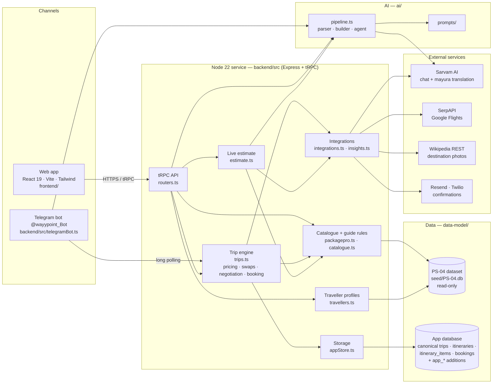
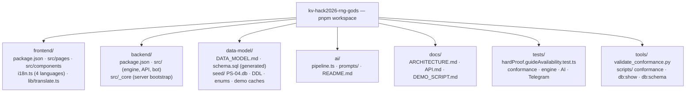
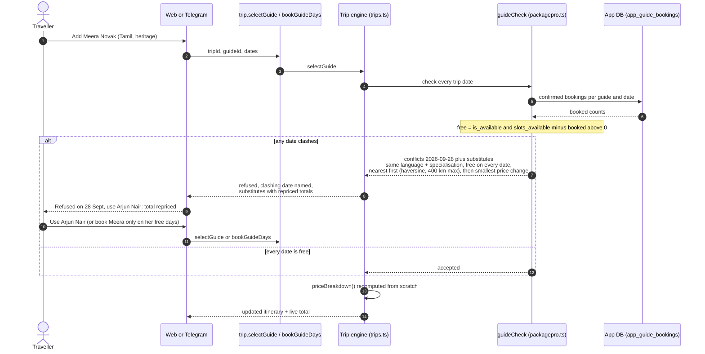
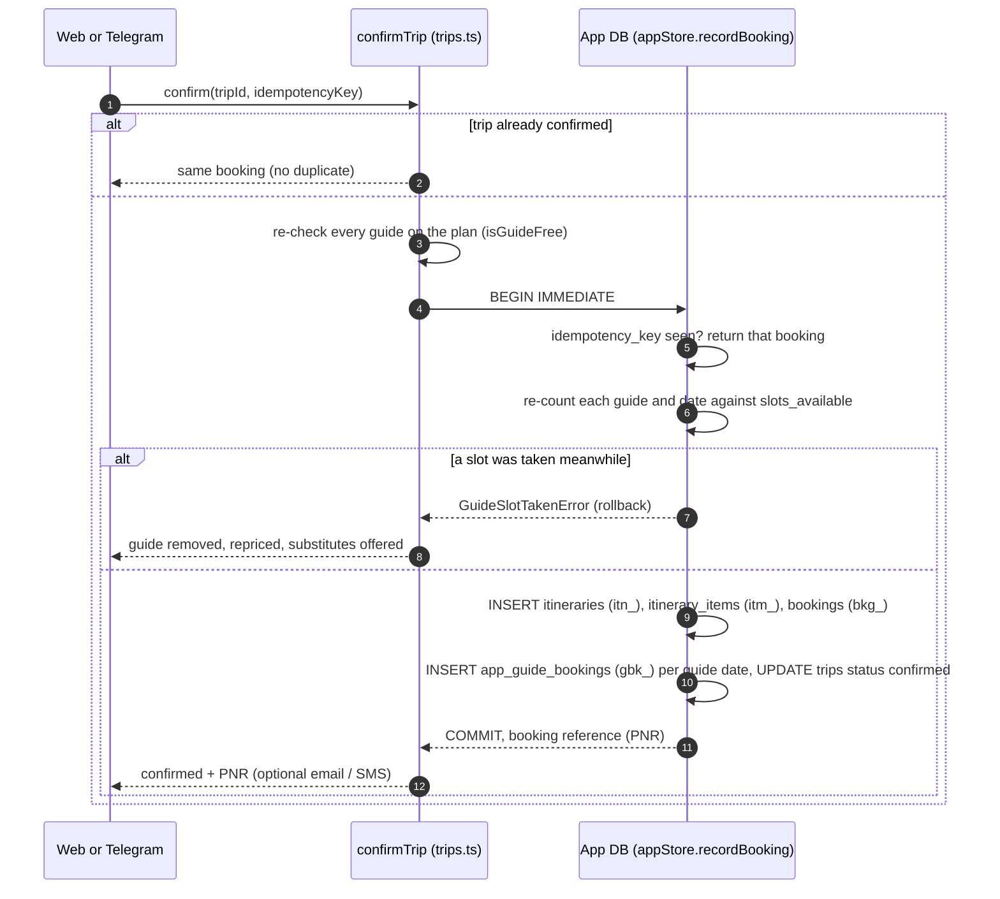
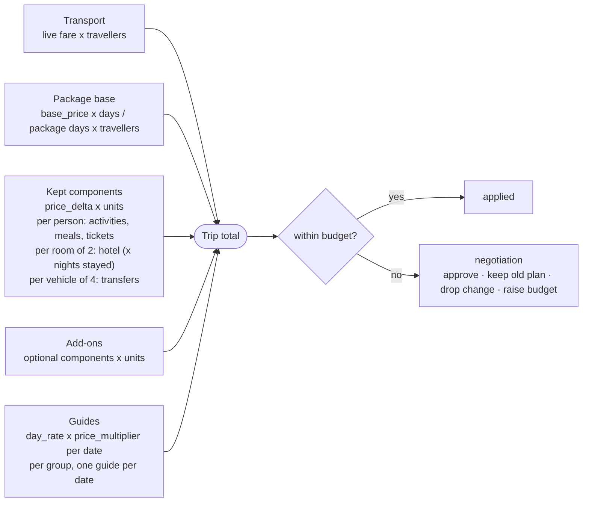
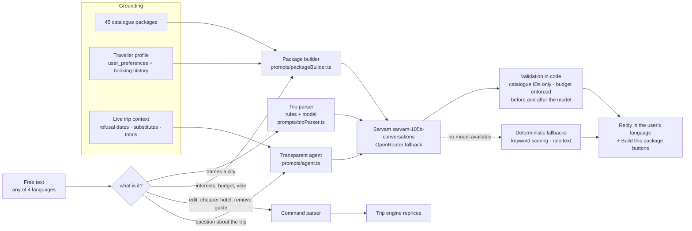
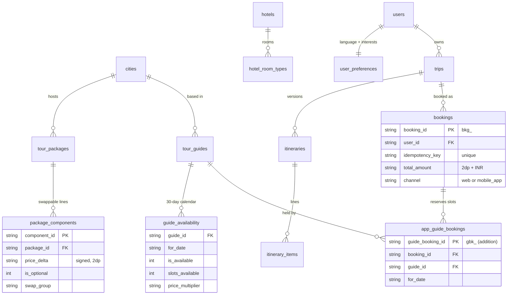
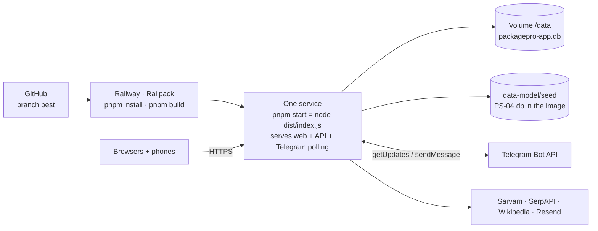

# PackagePro — architecture

PackagePro is **one TypeScript service with two channels**: the web app and a Telegram bot both drive the **same trip engine**,
so pricing, the guide availability check and bookings behave identically everywhere. The engine reads the organisers' PS-04
dataset (read-only) and writes the shared data model's canonical tables in a separate app database.

> Diagrams are Mermaid (rendered by GitHub). Static SVG copies live in [`docs/diagrams/`](diagrams/).

## 1 · System overview

## 2 · Repository map

## 3 · Mandatory enhancement — the guide availability check

Adding a guide is never a blind dropdown: every trip date is checked against `guide_availability` **and** the slots already
held by confirmed PackagePro bookings.

## 4 · Booking — one transaction, idempotent

## 5 · Pricing model

The PS-04 rule is *base + the deltas you keep*. Every change re-runs `priceBreakdown()` over the whole plan — nothing is
accumulated — and every sum is in **integer paise** (never a float).

## 6 · AI pipeline

## 7 · Data model — what we read, write and add

Read-only dataset tables: `tour_packages`, `package_components`, `tour_guides`, `guide_availability`, `hotels`,
`hotel_room_types`, `transfers`, `cities`, `languages`, `users`, `user_preferences`, `bookings → trips` (history).
Written canonical tables: `trips`, `itineraries`, `itinerary_items`, `bookings` (created verbatim from the dataset DDL).
Additions: `app_guide_bookings`, `app_trips`, `app_bot_sessions`, and `bookings.contact_email / contact_phone / guide_id`.
Full mapping and rules R1–R8: [`data-model/DATA_MODEL.md`](../data-model/DATA_MODEL.md).

## 8 · Deployment

Build: `vite build` (frontend → `dist/public`) + `esbuild` (backend → `dist/index.js`). Health check `/`; restart on failure.
Secrets only in Railway Variables. One instance (the trip engine caches active trips in memory in front of SQLite, and only
one process may poll a Telegram token).

## Components at a glance

| Component | Where | Responsibility |
|---|---|---|
| Web app | `frontend/src/pages/Home.tsx`, `HowItWorks.tsx`, `components/*` | Listing, detail, live estimate, flights, customiser (swaps, add-ons, duration, **guide planner grid**), review, PDF quotation, AI chat, traveller profile |
| API | `backend/src/routers.ts` | tRPC `packagepro.*` (catalogue, estimate, travellers, translate, AI) and `trip.*` (engine) — see [`API.md`](API.md) |
| Trip engine | `backend/src/trips.ts` | State machine `select_flight → select_package ⇄ negotiate → review → confirmed`; boundary rules (`assertTripRules`); pricing; guides whole-trip or day-by-day; idempotent booking; canonical rows |
| Catalogue & guide rules | `backend/src/catalogue.ts`, `packagepro.ts` | Dataset load; swappable packages; `isGuideFree()`, `guideCheck()` (clashes + nearest same-language/specialisation substitutes) |
| Traveller profiles | `backend/src/travellers.ts` | `users` + `user_preferences` + booking history |
| Estimate | `backend/src/estimate.ts` | Low ≤ typical ≤ high from live fares, base, components, guides; budget verdict; AI insight |
| AI | `ai/pipeline.ts`, `ai/prompts/*` | Parser, builder, agent, grounded completions — see [`ai/README.md`](../ai/README.md) |
| Storage | `backend/src/appStore.ts` | Canonical DDL at start-up, one transaction per booking, guide slot counts |
| Telegram | `backend/src/telegramBot.ts`, `botCopy.ts` | Same engine over buttons + free text, hand-written copy in 4 languages |

## Design decisions

- **One engine, two channels** — web and Telegram call the same functions, so a rule (like the guide check) is enforced once.
- **Recompute, never accumulate** — the total is rebuilt from the plan on every change, so swaps can't drift.
- **Integer paise** — rule R3 and the dataset's signed `price_delta` make floats unsafe.
- **SQLite (`node:sqlite`)** — the dataset ships as SQLite; zero-setup runs, one transaction guards the last guide slot.
- **Canonical tables created from the dataset's own DDL** — columns can never drift from the shared model.
- **Models are grounded and validated in code** — the builder only returns catalogue IDs within budget; every AI path has a
  deterministic fallback.
- **Hand-written copy for anything contractual** (terms, bot prompts) — machine translation is used only for dataset content.

## Quality gates

`pnpm verify` = type check + all offline test suites + production build, and it runs automatically before every `git push`
(`.githooks/pre-push`). `pnpm conformance` runs the organisers' `validate_conformance.py` on the dataset plus our rows → PASS.
