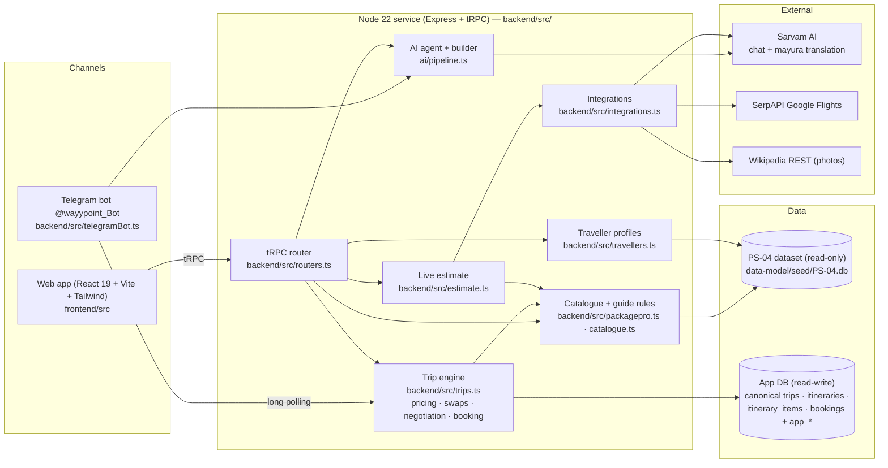

# PackagePro — architecture

One TypeScript service serves the web app, the tRPC API and the Telegram bot. Both channels drive **the same trip engine**, so
pricing, guide availability and bookings behave identically on web and chat.

## Components

| Component | File(s) | Responsibility |
|---|---|---|
| Web app | `frontend/src/pages/Home.tsx`, `frontend/src/components/*` | Package listing by theme, detail pages, live estimate, flight picker, the customiser (swaps, add-ons, duration, guide), review/booking, PDF quotation, AI chat. 4 UI languages (`frontend/src/i18n.ts`) + live translation of dataset content (`frontend/src/lib/translate.ts`) |
| API | `backend/src/routers.ts` | tRPC procedures: `packagepro.*` (list, detail, alternatives, estimate, recommend, travellers, translate, chat) and `trip.*` (create, selectFlight, swap, toggleAddOn, setDuration, guides, selectGuide, removeGuide, negotiate, continuePackage, goBack, confirm, bookings) |
| Trip engine | `backend/src/trips.ts` | State machine `select_flight → select_package ⇄ negotiate → review → confirmed`. Every change re-runs `priceBreakdown()` (never accumulates). Enforces boundary rules (`assertTripRules`), budget negotiation, idempotent confirmation, canonical rows |
| Catalogue & guide rules | `backend/src/catalogue.ts`, `backend/src/packagepro.ts` | Loads the dataset once; builds swappable packages; `isGuideFree()` (availability − confirmed slots), `guideCheck()` (clashes + nearest same-language/same-specialisation substitutes) |
| Traveller profiles | `backend/src/travellers.ts` | `users` + `user_preferences` + booking history → language preference and AI-builder grounding |
| Live estimate | `backend/src/estimate.ts` | Low / typical / high from live fares + base + default components + guides, a budget verdict, what past travellers booked, and a grounded AI insight |
| AI | `ai/pipeline.ts` | Trip-request parser, interest-based package builder, transparent explainer; grounded in catalogue + live trip context (see `ai/README.md`) |
| Integrations | `backend/src/integrations.ts`, `backend/src/insights.ts` | SerpAPI flights (cached, with fallbacks), Sarvam translation (disk cache), Wikipedia photos, Resend/Twilio confirmations |
| Storage | `backend/src/appStore.ts` | App database: canonical tables from the dataset DDL + `app_*` additions; one transaction per booking |
| Telegram bot | `backend/src/telegramBot.ts`, `backend/src/botCopy.ts` | Same engine over inline buttons + free text, hand-written copy in 4 languages |

## Key flows

**Pricing (PS-04 rule "base + the deltas you keep").** `total = transport × pax + base_price × days/duration × pax + Σ kept
component price_delta × units + add-ons + guide`. Units: per person (activities, meals, tickets, flights, package), per room of 2
(hotel, prorated by nights), per vehicle of 4 (transfers), per group (guide, `day_rate × price_multiplier` per date). All sums in
integer paise.

**Guide availability check (mandatory enhancement).** Adding a guide checks every trip date: `is_available` and a remaining slot
(`slots_available` − confirmed `app_guide_bookings`). Any clash → the selection is refused (the current plan is untouched), the
clashing dates are named, and substitutes with the same language and specialisation, free on every date, are ranked nearest-first
(haversine, ≤ 400 km) then by smallest price change, each with the repriced trip total. Confirmation re-checks capacity inside the
booking transaction, so two travellers can never take the same last slot.

**Budget negotiation.** A change that would exceed the budget is parked, not applied: approve the overage, keep the previous
plan, drop the change, or raise the budget.

**Booking.** `confirmTrip()` writes canonical `itineraries`, `itinerary_items` and `bookings` rows plus guide reservations in one
transaction, keyed by an idempotency key (a repeat returns the same booking).

## Deployment

Railway (Railpack): `pnpm build` (Vite client + esbuild server bundle) → `pnpm start`. A volume at `/data` holds the app database
(`PACKAGEPRO_APP_DB=/data/packagepro-app.db`). The Telegram bot runs inside the same process (long polling).
